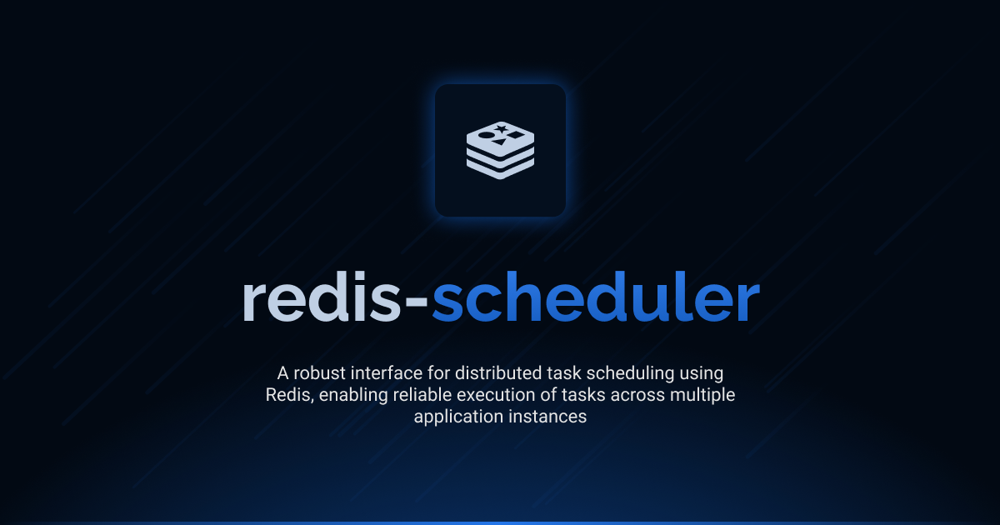

# Interface Redis Scheduler

[](LICENSE.md)
[](https://github.com/antelopejs/antelope)

A robust task scheduling system built on top of Redis. Interface Redis Scheduler enables reliable, distributed scheduling of tasks across multiple application instances, with support for automatic retries and failure handling.

## Installation

```bash
ajs module imports add redis_scheduler@beta
```

## Documentation

Detailed documentation is available in the `docs` directory:

- [Index](./docs/1.index.md) - Core functionality and usage examples

## Current Status

This is version 1 of the Interface Redis Scheduler. The Redis Scheduler interface uses a versioned interface system, with the current stable version being 1. This allows for potential future changes while maintaining backward compatibility.

## License

This project is licensed under the Apache License 2.0 - see the [LICENSE.md](LICENSE.md) file for details.
